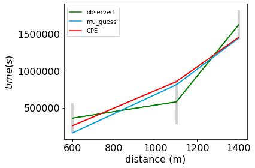
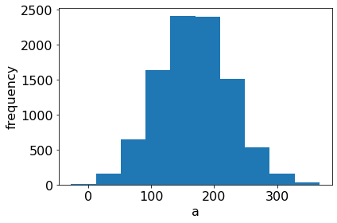

# CheKiPEUQ

Parameter estimation for complex physical problems often suffers from finding ‘solutions’ that are not physically realistic. The CheKiPEUQ software provides tools for finding physically realistic parameter estimates, graphs of the parameter estimate positions within parameter space, and plots of the final simulation results.

# A Quick Introduction

Why should you use CheKiPEUQ to get parameters from observed data? A few lines of code will give you realistic estimates and some graphs.

Consider a situation where we have three observed experimental data points with uncertainties:

Their values, including uncertainties, are: 
160500 +/- 200000  
810500 +/- 300000  
1440500 +/- 200000  

Consider that this situation is known to be described the following equation:
y=(x-a)^2 + b

Where we know that the physically realistic values of "a" and "b" are:  
a is expected to be 200 +/- 100   (this is the 1 sigma confidence interval)  
b is expected to be 500 +/- 200   (this is the 1 sigma confidence interval)  

If one tries to do a sum of squares fitting (conventional parameter estimation, CPE), we will not get realistic values for "a" and "b"  We get a = 255, b = 139153.  The value for "a" is fine, but the value for "b" is not realistic.

However, if we do a Bayesian Parameter Estimation (BPE), what CheKiPEUQ is designed for, then we get the following answers: a = 166 +/- 57, b= 509 +/- 198.  Where these errors are the 1 sigma credible intervals. Notice that now both of the parameters have physically realistic values.  We even have error bars that took into account the uncertainty! The covariance matrix for the parameters is also provided, so that the correlated uncertainties of estimated parameters is not lost.

How good is the match in this example?  
The fitting (CPE) gives the red line below: 

The Bayesian Parameter Estimation gives the black line below (and the red, not explained here):

We see that for this example, the CPE result from fitting and the BPE results do not look very different from each other. Both parameter estimation methods manage to stay in the error bars, yet the BPE result has a far more physically realistic pair of parameters!  This is the main purpose using CheKiPEUQ BPE: it will tend to give more realistic parameter estimates, and can even give a type of uncertainty (called credible intervals) on the final estimates.

Here is the code that was required after making the model equation:

<blockquote>
import CheKiPEUQ as CKPQ
import CheKiPEUQ.UserInput as UserInput
UserInput.model['InputParameterPriorValues'] = [200, 500] #prior expected values for a and b
UserInput.model['InputParametersPriorValuesUncertainties'] = [100, 200] #1 sigma, in this example not correlated, but a covariance matrix can be used instead.
UserInput.model['simulateByInputParametersOnlyFunction'] = simulation_model_00.simulation_function_wrapper #This just points to the User created model equation.
PE_object = CKPQ.parameter_estimation(UserInput)
PE_object.doMetropolisHastings()
PE_object.createAllPlots()
</blockquote>

There is a logfile generated called mcmc_log_file.txt (along with other files in the directory).
You will also get the following plots, some of which can be further customized, such as removing the bars from the contour plots. 

We can see that in this example the position and uncertainty in "a" narrowed more than that of "b".

* * *

The LICENSE and MANUAL are in the CheKiPEUQ directory and at https://github.com/AdityaSavara/CheKiPEUQ/tree/master/CheKiPEUQ
The LICENSE is a BSD-3-Clause LICENSE.

CheKiPEUQ stands for "Chemical Kinetics Parameter Estimation and Uncertainty Quantification", though the code is built to be general (not just for Chemical Kinetics).  The fun name can be pronounced in various ways such as "Check-ee-pook" or "Check-ee-peeoo" or "Check-ee-poo".

The recommended installation is to get Anaconda, then open an anaconda prompt and type `pip install CheKiPEUQ[COMPLETE]` (includes all optional dependencies). Leave out the '[COMPLETE]' if you want the minimal version.
The software can also be downloaded and used directly, or used by "python setup.py install" (the setup.py way will do basically the same thing as pip and will install the package appropriately to allow the module to be accessed by python regardless of directory, but this will not install the optional dependencies).

The file structure is such that the file `./CheKiPEUQ/__init__.py` is where the modules functions are loaded from. The main functionalities are inside `InverseProblem.py` , and various dependencies can be traced from those two files.

At present, the Examples directory contains various examples and a file named  ExamplesAndTutorialAndGettingStarted which provides some explanation.

In the relatively near future, the Examples may be separated into a complementary repository, and/or may be tucked away into the installation directory.
